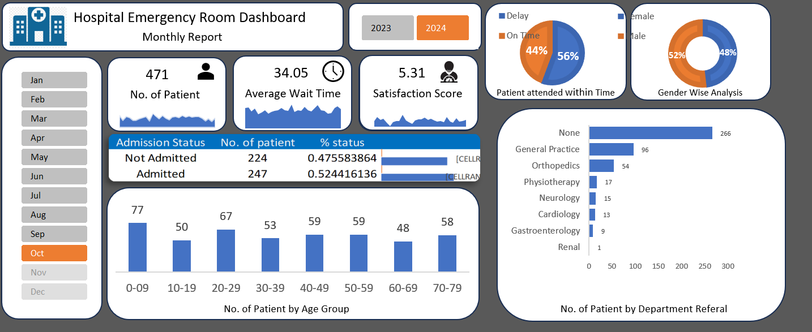
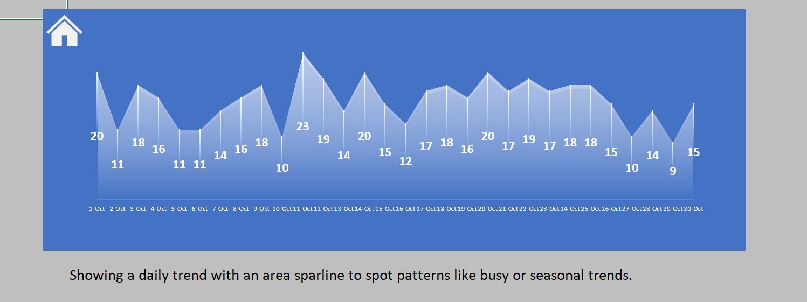
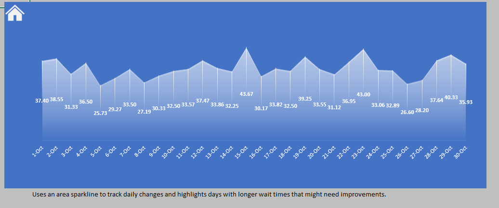
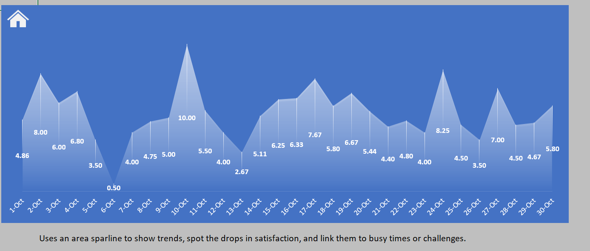

# Hospital Emergency Room Dashboard

---

## Project Overview

This project presents an interactive dashboard built in Microsoft Excel to analyze the performance of a hospital emergency room. The dashboard focuses on key operational metrics such as patient volume, waiting time, department load, and patient satisfaction.

The goal is to provide clear, data-driven insights that can help improve decision-making and operational efficiency in emergency healthcare services.

---

## Objectives

* Analyze patient inflow trends
* Identify peak hours and congestion patterns
* Evaluate waiting time performance
* Monitor patient satisfaction levels
* Support efficient resource allocation

---

## Tools and Technologies

* Microsoft Excel
* Pivot Tables and Pivot Charts
* Data Cleaning and Preparation
* Dashboard Design

---

## Dashboard Preview

### Overall Dashboard



---

### Patient Trend Analysis



This visualization shows how patient visits vary over time and helps identify peak demand periods.

---

### Waiting Time Analysis



This section highlights delays in service and helps detect operational bottlenecks.

---

### Patient Satisfaction Analysis



This metric reflects patient experience and service quality.

---

## Project Structure

```
hospital-emergency-room-dashboard/
│
├── dashboard/
│   └── Hospital Emergency Room Dashboard.xlsx
│
├── screenshots/
│   ├── dashboard_overview.png
│   ├── patient_trend.png
│   ├── wait_time.png
│   └── satisfaction_score.png
│
├── README.md
├── .gitignore
└── LICENSE
```

---

## How to Use

1. Download the Excel file from the dashboard folder
2. Open it in Microsoft Excel
3. Use filters and slicers to explore the data
4. Analyze trends and insights

---

## Key Insights

* Patient inflow varies significantly across different time periods
* Waiting time increases during peak hours
* Certain departments experience higher load
* Patient satisfaction is influenced by service delays

---

## Limitations

* The dataset is static and does not update in real time
* The dashboard is limited to Excel functionality
* No predictive analysis is included

---

## Future Improvements

* Integration with real-time data sources
* Advanced analytics and forecasting
* Migration to tools like Power BI or web-based dashboards
* Improved user interaction and design

---

## License

This project is licensed under the MIT License.
See the LICENSE file for more details.

---

## Acknowledgment

This project was developed as part of academic work for practical learning and skill development in data analysis and visualization.

---

## Author

Mohammad Ali Zaidi  
Punjabi University, Patiala  

For queries or collaboration, feel free to connect.
